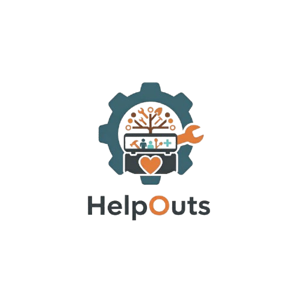

# What is HelpOuts?

HelpOuts is an application that connects the community with volunteers to get jobs done. Communities can store their projects and advertise jobs they need volunteers for to complete their project. A helper can request to join a community and once accepted, they can offer their help for any job requested by the community.

## Before starting

You will need to install:

- [Python](https://github.com/logos).
- [XAMPP](https://www.apachefriends.org/download.html)

## Creating the database
Once XAMPP is installed, select